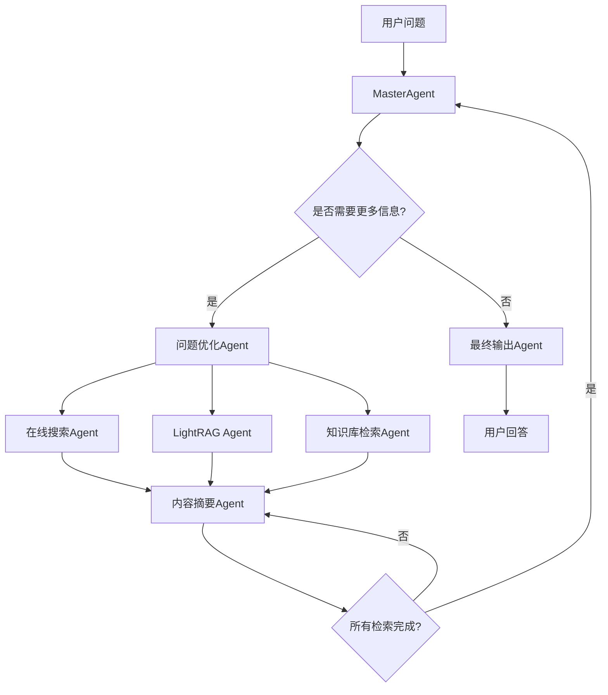

# 化妆品知识库问答机器人Pipeline项目

## 项目概述

### 核心目标
构建一个智能化妆品知识库问答系统，支持两种执行模式：
- **Workflow模式**：固定流程的多轮对话任务
- **Agent模式**：基于LangGraph的智能代理系统

### 技术架构
- **Workflow实现**：使用HTTP请求进行流式聊天接口调用
- **Agent实现**：基于LangGraph框架，支持流式响应
- **知识检索**：集成多源知识库API
  - 化妆品专业知识库：`http://localhost:8000/api/knowledge_search`
  - LightRAG检索系统
  - 在线搜索引擎

## 系统架构设计

### 核心类结构

#### 基础对话任务类 (BaseConversationTask)
```python
class BaseConversationTask:
    """对话任务基类"""
    - user_id:str                   # 用户ID
    - conversation_id: str          # 对话唯一标识
    - history: List[Message]        # 历史对话记录
    - current_stage: str           # 当前执行阶段
    - status: TaskStatus           # 任务状态

    def stream_response() -> Iterator[Dict]:
        """流式返回状态和消息内容"""
        pass
```

#### Workflow任务类 (WorkflowTask)
```python
class WorkflowTask(BaseConversationTask):
    """固定工作流对话任务"""
    def execute_workflow() -> Iterator[Dict]:
        """执行内部工作流，yield返回每个阶段结果"""
        pass
```

#### Agent任务类 (AgentTask)
```python
class AgentTask(BaseConversationTask):
    """智能代理对话任务"""
    def execute_agent_workflow() -> Iterator[Dict]:
        """执行Agent工作流，通过消息队列接收状态和输出"""
        pass
```
## 任务执行模式详细设计

### 任务类型定义

#### 1. Workflow多轮对话任务
**特点**：固定流程的结构化对话任务
**适用场景**：标准化问答流程，可预测的执行路径

#### 2. Agent多轮聊天任务
**特点**：复杂循环调用分析的智能工作流任务
**适用场景**：需要动态决策和复杂推理的场景

### Workflow任务执行流程

#### 阶段1：问题分析与规划
- **输入**：用户问题 + 历史对话记录
- **处理**：问题优化思考和任务规划
- **输出**：优化后的问题和执行计划
- **状态信息**：`analyzing_question`

#### 阶段2：任务分解与调度
- **输入**：优化后的问题和执行计划
- **处理**：生成分支任务JSON配置
- **输出**：并行任务列表
  ```json
  {
    "tasks": [
      {"type": "online_search", "query": "优化后的搜索问题"},
      {"type": "knowledge_search", "query": "知识库检索问题"},
      {"type": "lightrag_search", "query": "LightRAG检索问题"}
    ]
  }
  ```
- **状态信息**：`task_scheduling`

#### 阶段3：并行任务执行
- **输入**：分支任务配置
- **处理**：并行执行多个检索任务
- **输出**：各任务的检索结果
- **状态信息**：`executing_tasks`

#### 阶段4：结果整合与回答
- **输入**：所有分支任务的返回结果
- **处理**：整理和融合多源信息
- **输出**：最终回答
- **状态信息**：`generating_answer`
### Agent任务执行架构

#### 全局状态管理
Agent系统维护多个上下文状态，用于跨Agent信息共享：

```python
@dataclass
class GlobalContext:
    """全局上下文状态"""
    online_search_context: OnlineSearchContext
    knowledge_search_context: KnowledgeSearchContext
    lightrag_context: LightRagContext
    conversation_history: List[Message]
    current_stage: str

@dataclass
class OnlineSearchContext:
    """在线搜索上下文"""
    context_list: List[Dict]        # 搜索结果列表
    context_summary: str            # 内容摘要
    search_queries: List[str]       # 历史查询
    last_updated: datetime          # 最后更新时间

@dataclass
class KnowledgeSearchContext:
    """知识库搜索上下文"""
    context_list: List[Dict]        # 知识库结果
    context_summary: str            # 内容摘要
    search_queries: List[str]       # 历史查询
    confidence_scores: List[float]  # 置信度分数

@dataclass
class LightRagContext:
    """LightRAG上下文"""
    context_list: List[Dict]        # 回答结果列表
    context_summary: str            # 内容摘要
```

#### Agent类型与职责

##### 1. 总控制者Agent (MasterAgent)
**核心职责**：意图识别、流程控制、决策调度
- **输入**：用户问题、历史对话、全局状态摘要
- **处理**：判断当前信息是否足够回答问题，决定下一步行动
- **输出**：控制指令JSON
- **控制流程**：
  ```
  MasterAgent → 问题优化Agent → [并行执行检索Agents] → 内容摘要Agent → MasterAgent → 最终输出Agent
  ```

##### 2. 问题优化Agent (QueryOptimizationAgent)
**核心职责**：针对不同检索源优化问题表述
- **输入**：原始问题、目标Agent类型、相关上下文摘要
- **处理**：根据目标Agent特点优化问题
- **输出**：优化后的查询问题
- **特殊功能**：支持针对不同Agent的定制化问题优化

##### 3. 在线搜索Agent (OnlineSearchAgent)
**核心职责**：执行在线搜索并提取关键信息
- **输入**：优化后的搜索问题
- **处理**：调用搜索API + LLM内容分析
- **输出**：结构化搜索结果
- **后续动作**：自动调用内容摘要Agent

##### 4. LightRAG检索Agent (LightRagAgent)
**核心职责**：执行知识图谱检索和推理
- **输入**：优化后的RAG问题
- **处理**：调用LightRAG mix问答API
- **输出**：lightrag回答内容
- **后续动作**：自动调用内容摘要Agent

##### 5. 化妆品知识库检索Agent (KnowledgeSearchAgent)
**核心职责**：专业知识库检索
- **输入**：优化后的知识库查询
- **处理**：调用专业知识库API
- **输出**：专业知识检索结果
- **后续动作**：自动调用内容摘要Agent

##### 6. 内容摘要Agent (SummaryAgent)
**核心职责**：多源信息摘要和整合
- **输入**：特定类型的检索结果列表、用户问题
- **处理**：生成针对性的内容摘要
- **输出**：结构化长摘要
- **触发条件**：所有检索Agent完成后，调用总控制者

##### 7. 最终输出Agent (FinalOutputAgent)
**核心职责**：生成最终用户回答
- **输入**：全局状态中的所有知识和摘要、用户问题
- **处理**：融合多源信息生成综合回答
- **输出**：最终用户回答

#### Agent执行流程图



## 数据结构与接口定义

### 核心数据结构

#### 消息结构
```python
@dataclass
class Message:
    role: str              # user/assistant/system
    content: str           # 消息内容
    timestamp: datetime    # 时间戳
    metadata: Dict         # 元数据（如来源、置信度等）
```

#### 任务状态枚举
```python
class TaskStatus(Enum):
    PENDING = "pending"           # 等待执行
    RUNNING = "running"           # 执行中
    COMPLETED = "completed"       # 已完成
    ERROR = "error"              # 执行错误
    CANCELLED = "cancelled"       # 已取消
```

#### 流式响应格式
```python
@dataclass
class StreamResponse:
    conversation_id: str          # 对话ID
    stage: str                   # 当前阶段
    status: TaskStatus           # 任务状态
    content: str                 # 消息内容
    agent_type: Optional[str]    # Agent类型（Agent模式）
    metadata: Dict               # 附加信息
    timestamp: datetime          # 响应时间
    progress: float              # 执行进度 (0.0-1.0)
```

### API接口设计

#### Pipeline主接口
```python
class PipelineInterface:
    def create_conversation(self, user_id: str, mode: str) -> str:
        """创建新对话会话"""
        pass

    def send_message(self, conversation_id: str, message: str) -> Iterator[StreamResponse]:
        """发送消息并获取流式响应"""
        pass

    def get_conversation_history(self, conversation_id: str) -> List[Message]:
        """获取对话历史"""
        pass
```

#### 知识检索接口
```python
class KnowledgeRetrievalInterface:
    def search_cosmetics_knowledge(self, query: str) -> Dict:
        """化妆品知识库检索"""
        pass

    def search_lightrag(self, query: str, mode: str = "mix") -> Dict:
        """LightRAG检索"""
        pass

    def search_online(self, query: str, num_results: int = 5) -> Dict:
        """在线搜索"""
        pass
```

## 项目技术要求

### 核心技术栈
**Agent实现**：基于LangGraph框架构建智能代理系统，支持状态管理和流式响应
**Workflow实现**：使用异步HTTP请求实现固定流程的多轮对话

### 目录结构设计
**要求**：实现良好的模块解耦和代码组织，特别针对LangGraph Agent架构优化

```
intent_agent_pipeline/
├── app/
│   ├── __init__.py
│   ├── main.py                 # FastAPI应用入口
│   ├── config/
│   │   ├── __init__.py
│   │   ├── settings.py         # 配置管理
│   │   └── logging.py          # 日志配置
│   ├── core/
│   │   ├── __init__.py
│   │   ├── base_task.py        # BaseConversationTask基类
│   │   ├── workflow_task.py    # WorkflowTask实现
│   │   ├── agent_task.py       # AgentTask实现
│   │   └── pipeline.py         # Pipeline主接口
│   ├── agents/
│   │   ├── __init__.py
│   │   ├── base_agent.py       # LangGraph Agent基类
│   │   ├── master_agent.py     # 总控制者Agent
│   │   ├── query_optimizer.py  # 问题优化Agent
│   │   ├── search_agents/
│   │   │   ├── __init__.py
│   │   │   ├── online_search.py    # 在线搜索Agent
│   │   │   ├── lightrag_agent.py   # LightRAG Agent
│   │   │   └── knowledge_search.py # 知识库检索Agent
│   │   ├── summary_agent.py    # 内容摘要Agent
│   │   └── output_agent.py     # 最终输出Agent
│   ├── langgraph/
│   │   ├── __init__.py
│   │   ├── graph_builder.py    # LangGraph图构建器
│   │   ├── state_manager.py    # 状态管理器
│   │   ├── node_definitions.py # 节点定义
│   │   ├── edge_conditions.py  # 边条件定义
│   │   └── checkpoints/        # 检查点存储
│   │       ├── __init__.py
│   │       ├── memory_store.py # 内存存储
│   │       └── redis_store.py  # Redis存储
│   ├── services/
│   │   ├── __init__.py
│   │   ├── knowledge_service.py    # 知识库服务
│   │   ├── lightrag_service.py     # LightRAG服务
│   │   ├── search_service.py       # 搜索服务
│   │   └── llm_service.py          # LLM调用服务
│   ├── models/
│   │   ├── __init__.py
│   │   ├── message.py          # 消息数据模型
│   │   ├── context.py          # 上下文数据模型
│   │   ├── response.py         # 响应数据模型
│   │   └── enums.py            # 枚举类型定义
│   ├── api/
│   │   ├── __init__.py
│   │   ├── v1/
│   │   │   ├── __init__.py
│   │   │   ├── pipeline.py     # Pipeline API路由
│   │   │   └── health.py       # 健康检查API
│   │   └── middleware/
│   │       ├── __init__.py
│   │       ├── cors.py         # CORS中间件
│   │       └── logging.py      # 日志中间件
│   └── utils/
│       ├── __init__.py
│       ├── async_utils.py      # 异步工具函数
│       ├── stream_utils.py     # 流式处理工具
│       └── validation.py       # 数据验证工具
├── tests/
│   ├── __init__.py
│   ├── conftest.py            # pytest配置
│   ├── unit/                  # 单元测试
│   ├── integration/           # 集成测试
│   └── e2e/                   # 端到端测试
├── docker/
│   ├── Dockerfile
│   ├── docker-compose.yml
│   └── docker-compose.dev.yml
├── requirements.txt
├── requirements-dev.txt
├── .env.example
├── .gitignore
└── README.md
```

### 依赖和框架要求

#### 核心框架
- **FastAPI**: 现代高性能Web框架，支持异步和自动API文档
- **Pydantic**: 数据验证和序列化
- **LangGraph**: Agent工作流框架，支持状态管理和条件路由
- **LangChain**: LLM集成和工具调用框架

#### LangGraph特性要求
- **状态持久化**: 支持内存和Redis两种检查点存储方式
- **流式响应**: 集成LangGraph的流式输出能力
- **条件路由**: 基于Agent决策的动态流程控制
- **并行执行**: 支持多Agent并行处理

#### 异步和并发
```python
# requirements.txt 核心依赖
fastapi>=0.104.0
uvicorn[standard]>=0.24.0
pydantic>=2.5.0
langgraph>=0.2.0
langchain>=0.2.0
langchain-openai>=0.1.0
aiohttp>=3.9.0
redis>=5.0.0
asyncio>=3.4.3
```

#### 容器化配置

**Dockerfile**:
```dockerfile
FROM python:3.11-slim

WORKDIR /app

# 安装系统依赖
RUN apt-get update && apt-get install -y \
    gcc \
    && rm -rf /var/lib/apt/lists/*

# 安装Python依赖
COPY requirements.txt .
RUN pip install --no-cache-dir -r requirements.txt

# 复制应用代码
COPY app/ ./app/

# 暴露端口
EXPOSE 8000

# 启动命令
CMD ["uvicorn", "app.main:app", "--host", "0.0.0.0", "--port", "8000"]
```

**docker-compose.yml**:
```yaml
version: '3.8'

services:
  intent-agent-pipeline:
    build: .
    ports:
      - "8000:8000"
    environment:
      - ENVIRONMENT=production
      - LOG_LEVEL=info
    volumes:
      - ./logs:/app/logs
    depends_on:
      - redis
    restart: unless-stopped

  redis:
    image: redis:7-alpine
    ports:
      - "6379:6379"
    volumes:
      - redis_data:/data


volumes:
  redis_data:
```

### LangGraph集成要求

#### LangGraph状态管理
```python
from typing import TypedDict, Annotated
from langgraph.graph import StateGraph, END
from langgraph.checkpoint.memory import MemorySaver
from langgraph.checkpoint.redis import RedisSaver

class AgentState(TypedDict):
    """LangGraph状态定义"""
    user_question: str
    conversation_history: List[Dict]
    online_search_results: List[Dict]
    knowledge_search_results: List[Dict]
    lightrag_results: List[Dict]
    current_stage: str
    final_answer: str
    metadata: Dict

class LangGraphManager:
    """LangGraph图管理器"""

    def __init__(self, checkpoint_type: str = "memory"):
        self.checkpoint_type = checkpoint_type
        self.checkpointer = self._create_checkpointer()
        self.graph = self._build_graph()

    def _create_checkpointer(self):
        """创建检查点存储器"""
        if self.checkpoint_type == "redis":
            return RedisSaver.from_conn_info(host="localhost", port=6379, db=1)
        return MemorySaver()

    def _build_graph(self) -> StateGraph:
        """构建LangGraph工作流图"""
        workflow = StateGraph(AgentState)

        # 添加节点
        workflow.add_node("master_agent", self.master_agent_node)
        workflow.add_node("query_optimizer", self.query_optimizer_node)
        workflow.add_node("parallel_search", self.parallel_search_node)
        workflow.add_node("summary_agent", self.summary_agent_node)
        workflow.add_node("final_output", self.final_output_node)

        # 添加边和条件
        workflow.set_entry_point("master_agent")
        workflow.add_conditional_edges(
            "master_agent",
            self.should_continue_search,
            {
                "continue": "query_optimizer",
                "finish": "final_output"
            }
        )
        workflow.add_edge("query_optimizer", "parallel_search")
        workflow.add_edge("parallel_search", "summary_agent")
        workflow.add_edge("summary_agent", "master_agent")
        workflow.add_edge("final_output", END)

        return workflow.compile(checkpointer=self.checkpointer)
```

#### 并发处理要求

#### 协程并发架构
```python
# 核心并发设计原则
import asyncio
from typing import AsyncIterator
from concurrent.futures import ThreadPoolExecutor

class ConcurrentTaskManager:
    """并发任务管理器"""

    def __init__(self, max_workers: int = 10):
        self.executor = ThreadPoolExecutor(max_workers=max_workers)
        self.semaphore = asyncio.Semaphore(max_workers)

    async def execute_parallel_agents(self, agents: List[BaseAgent]) -> List[Dict]:
        """并行执行多个Agent"""
        async with self.semaphore:
            tasks = [agent.execute() for agent in agents]
            results = await asyncio.gather(*tasks, return_exceptions=True)
            return results

    async def execute_workflow_stages(self, stages: List[Callable]) -> AsyncIterator[Dict]:
        """按阶段执行工作流"""
        for stage in stages:
            async with self.semaphore:
                result = await stage()
                yield result
```


### 流式返回设计

#### 响应类型区分
```python
from enum import Enum
from pydantic import BaseModel

class ResponseType(Enum):
    STATUS = "status"           # 状态信息
    CONTENT = "content"         # 聊天内容
    PROGRESS = "progress"       # 进度信息
    ERROR = "error"            # 错误信息

class StreamResponse(BaseModel):
    conversation_id: str
    response_type: ResponseType
    timestamp: datetime

    # 状态信息字段
    stage: Optional[str] = None
    agent_name: Optional[str] = None
    status: Optional[TaskStatus] = None
    progress: Optional[float] = None

    # 内容字段
    content: Optional[str] = None
    metadata: Optional[Dict] = None

    # 错误字段
    error_code: Optional[str] = None
    error_message: Optional[str] = None

# 使用示例
async def stream_responses() -> AsyncIterator[StreamResponse]:
    # 状态信息
    yield StreamResponse(
        conversation_id="conv_123",
        response_type=ResponseType.STATUS,
        stage="query_optimization",
        agent_name="QueryOptimizer",
        status=TaskStatus.RUNNING,
        progress=0.1
    )

    # 聊天内容
    yield StreamResponse(
        conversation_id="conv_123",
        response_type=ResponseType.CONTENT,
        content="正在优化您的问题...",
        metadata={"source": "system"}
    )
```

#### FastAPI流式端点实现
```python
from fastapi import FastAPI
from fastapi.responses import StreamingResponse
import json

@app.post("/api/v1/chat/stream")
async def stream_chat(request: ChatRequest):
    """流式聊天接口"""

    async def generate_stream():
        pipeline = PipelineInterface()

        async for response in pipeline.send_message(
            request.conversation_id,
            request.message
        ):
            # 区分不同类型的响应
            if response.response_type == ResponseType.STATUS:
                # 状态信息：JSON格式
                yield f"data: {json.dumps(response.dict())}\n\n"

            elif response.response_type == ResponseType.CONTENT:
                # 聊天内容：特殊格式标记
                yield f"data: {json.dumps({
                    'type': 'content',
                    'content': response.content,
                    'timestamp': response.timestamp.isoformat()
                })}\n\n"

            elif response.response_type == ResponseType.ERROR:
                # 错误信息
                yield f"data: {json.dumps({
                    'type': 'error',
                    'error': response.error_message,
                    'code': response.error_code
                })}\n\n"
                break

    return StreamingResponse(
        generate_stream(),
        media_type="text/plain",
        headers={
            "Cache-Control": "no-cache",
            "Connection": "keep-alive",
            "Content-Type": "text/event-stream"
        }
    )
```

### 质量保证要求

#### 代码质量
- **类型提示**：所有函数和类都必须有完整的类型注解
- **文档字符串**：使用Google风格的docstring

#### 监控和日志
- **结构化日志**：使用JSON格式记录关键事件
- **性能监控**：记录响应时间、内存使用等指标
- **错误追踪**：完整的错误堆栈和上下文信息
- **健康检查**：提供系统健康状态API